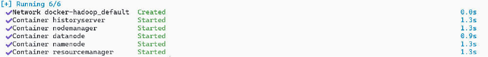
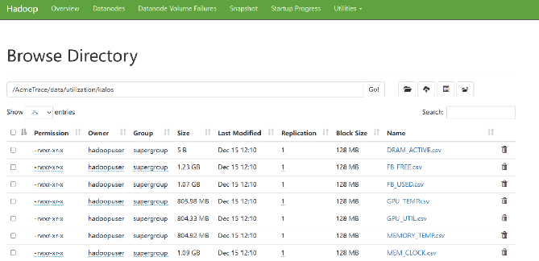
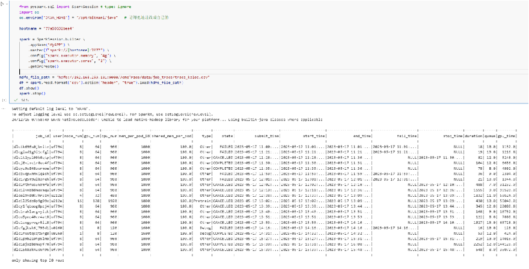
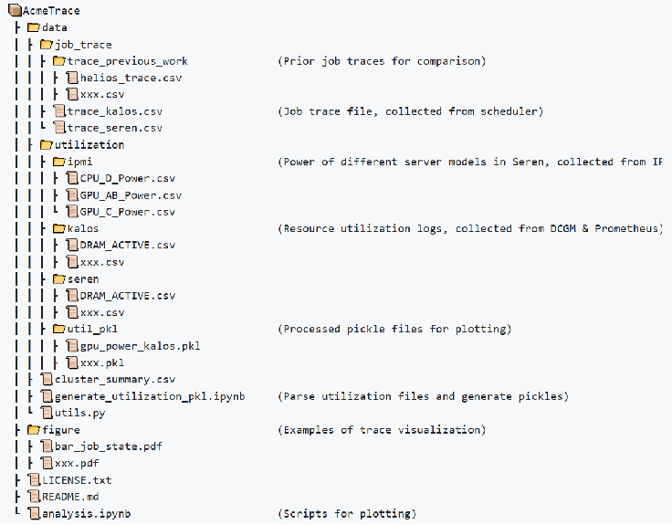
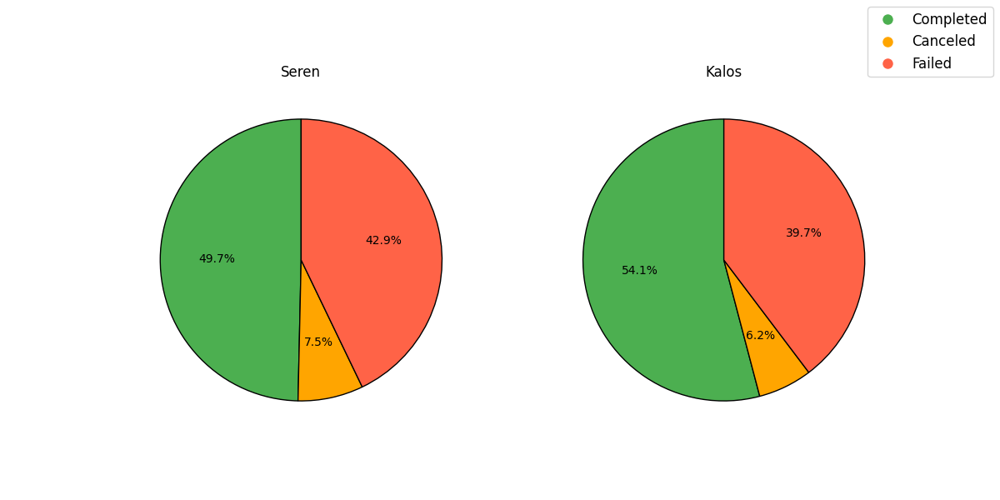
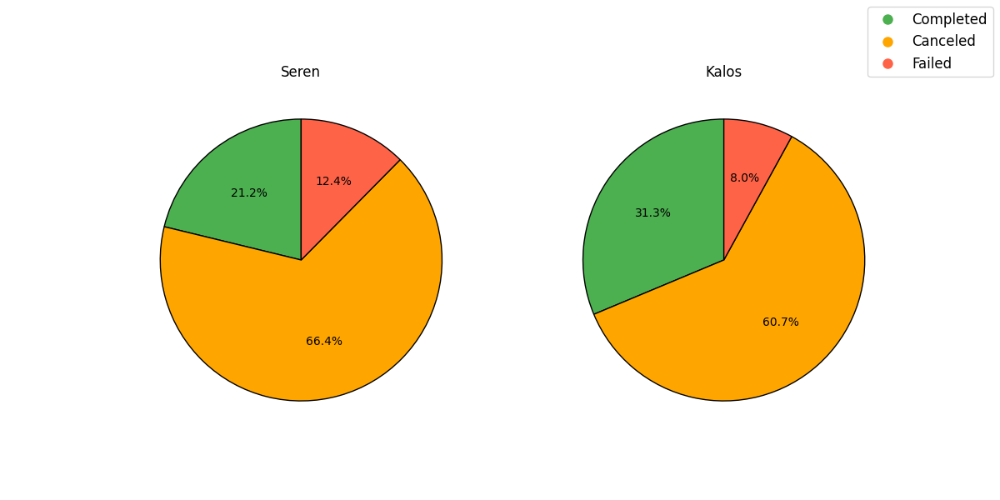
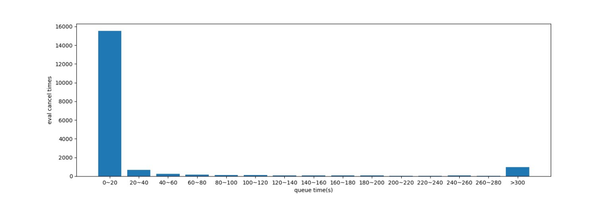
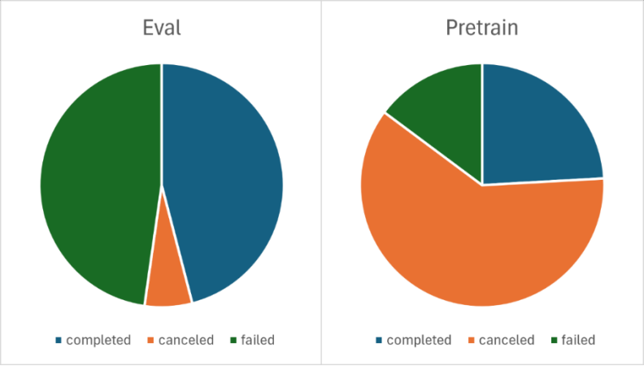
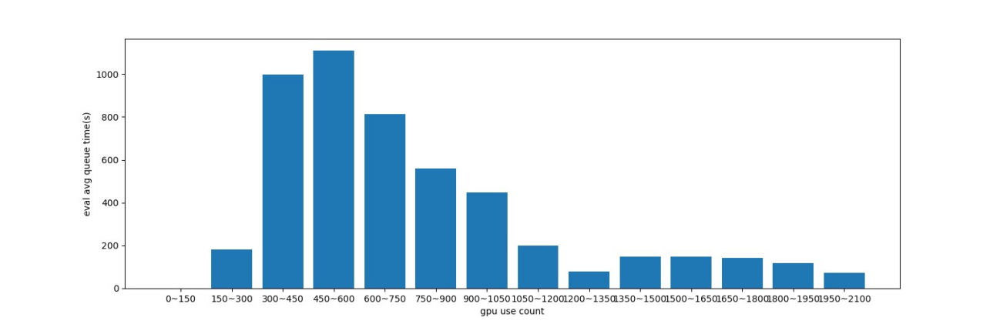
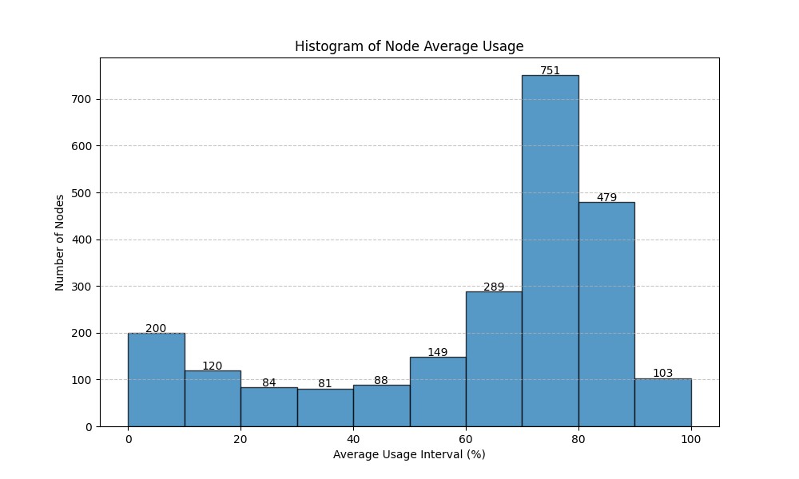

# 基于Spark的AcmeTrace的LLM集群工作负载研究

## 研究目的

- 基于Spark分析AcmeTrace的LLM集群工作负载
- LLM集群任务高失败率情况LLM集群Eval任务排队时延情况
- LLM集群节点GPU资源使用情况

### 环境搭建

#### 环境准备&启动集群

##### 基于 github 仓库 big-data-europe/docker-Hadoop 部署 Hadoop 集群

##### 将 AcmeTrace 数据集上传至 HDFS

#### 验证集群功能

##### 编写了一个 PySpark 程序，通过 Spark 集群读取了 HDFS 文件中的数据。程序连接到 Spark Master，配置了执行器的内存和核心数，并成功加载了存储在 HDFS 中的 CSV 文件，展示了文件的内容。整个过程验证了集群与 HDFS 的集成效果，证明了 Spark 在分布式环境下的数据处理能力。

### 数据集介绍

##### 数据集简介：       AcmeTrace是上海人工智能工作室对其大语言模型InternLM的训练过程加以记录生成的trace。该trace记录了工作室Seren和Kalos两个共搭载了4704块A100的大型GPU计算集群时长6个月的日志记录。

##### 数据集特征：完整数据集大小: 80GB (在 HuggingFace 上)持续时间: 6个月独立GPU集群数量: 2总任务数量: 880,740GPU任务总数: 470,497

## 研究结果

#### 任务高失败率分析

##### 基于AcmeTrace进行统计，可以发现，对于Pretrain和Eval任务，成功（即任务状态标识为COMPLETED的任务）率并不高。而在未成功任务中，被取消的任务占了相当大的部分，并且这一部分消耗了相当大的计算资源。

##### 如果对Eval和Pretrain分别进行任务完成情况的统计（以数据量更大的Seren集群为例），Pretrain任务被取消的比例很高，而这一比例在Eval任务中较低。原因分析：模型训练任务需要频繁调整参数，通过多次尝试寻求更优的训练效果。这通常无法在初期直接发现，而需要经过一段时间训练后评估效果并与之前对比。如果发现问题或改进点，工作人员可能会中断任务。相比之下，评估任务参数调整较少，取消行为通常是由于评估方法的微调。

##### 	为了研究剩余可用资源与Eval任务排队时延的关系，对job_trace进行统计，任务正式开始时视为资源分配成功，任务结束（包括成功、失败、取消）时视为资源释放，依此统计实时已分配GPU个数。对不同GPU个数下Eval和Pretrain任务的排队时延进行统计。原因分析：Pretrain任务除了在低资源占用时拥有异常的排队时延（在Kalos上未发现相同状况，可能由于异常数据点导致），其他时候均拥有较低的排队时延，而Eval的平均排队时延通常会达到100s以上。由此可见，由于优先级设定，Eval任务确实会比Pretrain任务拥有更高的排队时延。0

##### 集群使用率分布：高利用率区间（70%-100%）70%-80% 区间：751个节点，数量最多，占比最大。80%-90% 区间：479个节点，次高。90%-100% 区间：103个节点。大量节点处于高负载状态，GPU资源得到了较充分的利用。低利用率区间（0%-20%）0%-10% 区间：200个节点，数量较高，显示部分节点的GPU资源处于空闲或低负载状态。10%-20% 区间：120个节点，进一步说明低负载节点的比例不可忽视。中等使用率区间（20%-60%）20%-30%：84个节点30%-40%：81个节点40%-50%：88个节点50%-60%：149个节点中等使用率节点数量较少，GPU使用率分布存在两极化特征。

#### 小组分工
马健文  环境部署 预测性分析与机器学习应用 30%

徐博阳  Eval任务排队时延分析 PPT制作 30%

马润东  任务完成情况分析 实验数据汇总和分析 20%

钱惠勋  环境配置 集群GPU使用率分析 20%
